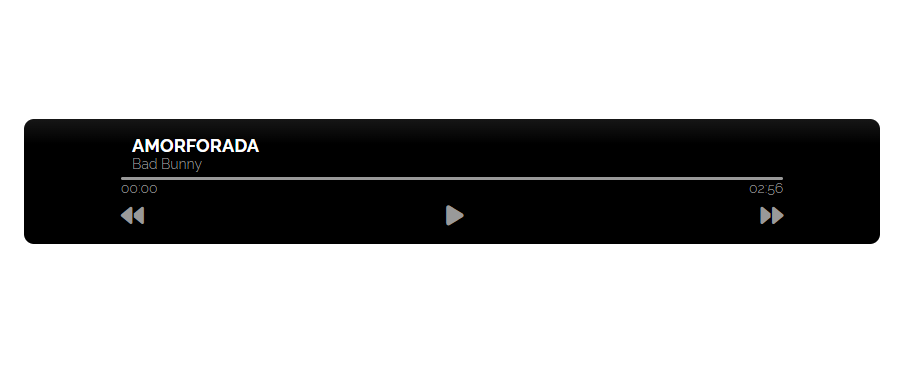

# 🎵 Music Player  

## 📌 Descripción  
**Music Player** es una aplicación web que permite reproducir música de manera sencilla e intuitiva. Ofrece controles básicos y una interfaz amigable para disfrutar de tus canciones favoritas.  

## 🚀 Características  
- ▶️ **Reproducción de audio** con controles de **play, pause y stop**.  
- 🔄 **Botones de siguiente y anterior** para cambiar de canción.  
- 📂 **Soporte para listas de reproducción**.  
- 🎚 **Control de volumen** ajustable.  
- ⏱ **Barra de progreso interactiva** para avanzar o retroceder en la canción.  
- 🌐 **Interfaz minimalista y responsive**.  

## 🛠 Tecnologías utilizadas  
- HTML, CSS, JavaScript  
- [Si usaste un framework o librerías como Howler.js, agrégalo aquí]  

## 🎮 Cómo usar  
1. Carga tus canciones en el reproductor.  
2. Usa los controles para reproducir, pausar o cambiar de pista.  
3. Selecciona un punto en la barra de progreso.  

